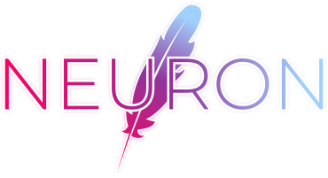

# Neuron

Neuron is a language that compiles directly into HTML, CSS, and JavaScript.

## Features
- Object-oriented programming
- Consise and forgiving syntax
- Features the long-awaited unity of HTML, CSS, and JavaScript
- Support in most browsers without third-party software
- Comprehensive standard library
